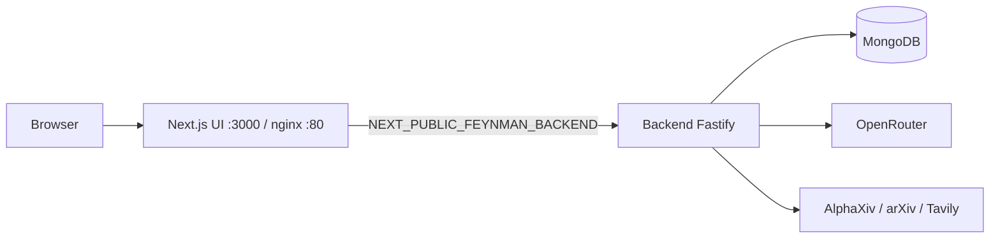
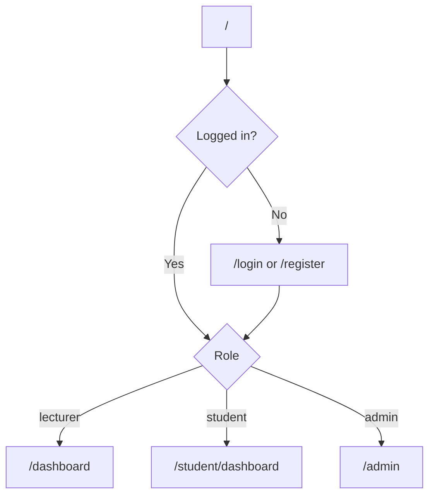
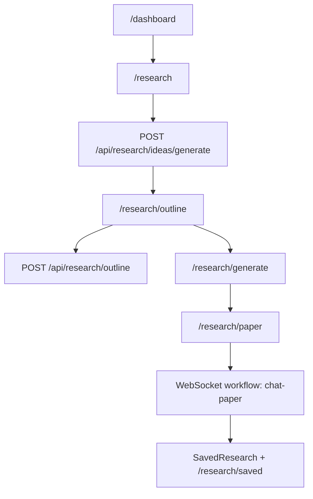
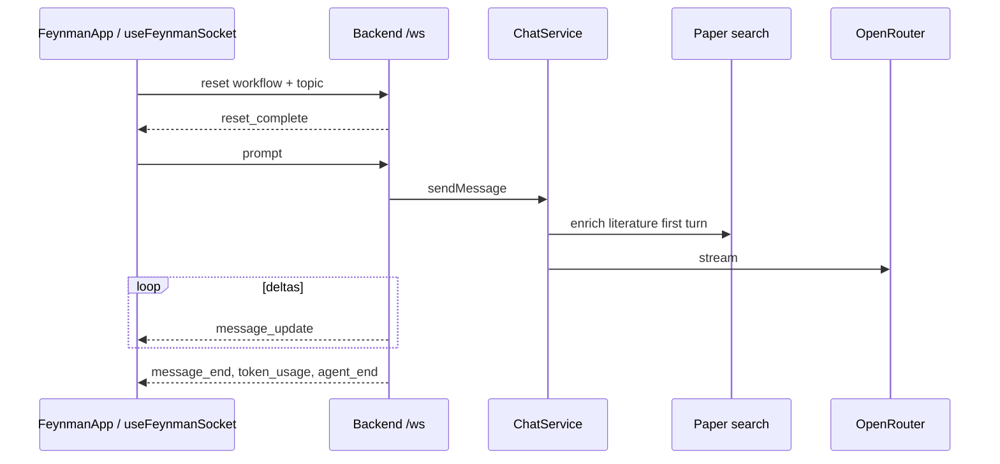

# Project Workflow — GARIL AI Frontend

End-to-end product workflows from the **UI** side: user journeys, WebSocket client protocol, research flows, and local development for this frontend repo.

The agentic runtime, literature APIs, and MongoDB live in the **backend** service. This app talks to it over HTTP `/api/*` and WebSocket `/ws`.

---

## Architecture



| Layer | Stack | Default |
|-------|--------|---------|
| Frontend (this repo) | Next.js 16, React 19, static export | http://localhost:3000 |
| Backend (separate) | Fastify + MongoDB | http://127.0.0.1:3141 |
| API base | `lib/api.ts` → `getBackendOrigin()` | env or `:3141` in dev |

---

## 1. User journeys

### Landing → auth → dashboard



1. Public landing (`/`) → register or login.
2. Auth APIs (backend): `POST /api/auth/login`, `/register`, `/register-student`.
3. Role routing (`lib/dashboard-routes.ts`):
   - student → `/student/dashboard`
   - lecturer / researcher → `/dashboard`
   - admin → `/admin`

### Lecturer research (canonical product flow)



| Step | Route / API | What happens |
|------|-------------|--------------|
| 1. Ideas | `/research` | Discipline, topic, scope → generated research ideas |
| 2. Outline | `/research/outline` | Literature-backed Markdown outline |
| 3. Configure | `/research/generate` | Citation style and paper options |
| 4. Draft | `/research/paper` | WebSocket `chat-paper` streams full paper |
| 5. Library | `/research/saved` | Persisted papers |

Student path mirrors this under `/student/research/*`.

### Other product surfaces

| Flow | Paths |
|------|--------|
| Paper drafting | `/research/paper` → `FeynmanApp` |
| Research Note | `/research/note` → notebook UI |
| Lesson planner | `/lesson-planner` (+ presentation / saved) |
| References | `/references` |
| Admin | `/admin/*` — users, tokens, governance |
| Super admin | `/super-admin/*` — universities / platform |

---

## 2. Agentic chat — frontend client

Runtime is on the backend (`ChatService`). The UI drives it over WebSocket.



### WebSocket protocol

**Client → server**

| Message | Purpose |
|---------|---------|
| `{ type: "reset", workflow?, topic?, message? }` | New session / workflow |
| `{ type: "prompt", message }` | User turn |
| `{ type: "abort" }` | Cancel run |

**Server → client**

| Message | Purpose |
|---------|---------|
| `connected` | Status + workflow list |
| `agent_event` | `agent_start`, `tool_execution_*`, `message_update`, `message_end`, `token_usage`, `agent_end` |
| `reset_complete` / `prompt_complete` / `aborted` / `error` | Lifecycle |
| `student_token_quota` | Remaining tokens |

**Paper client sequence** (`hooks/useFeynmanSocket.ts` → `sendResearchPaper`):

1. `reset` with `workflow: "chat-paper"` and `topic`
2. On `reset_complete`, send `prompt` with the full paper prompt (outline embedded)

Key helpers: `lib/agent-events.ts`, `lib/prepare-research-paper.ts`, `lib/api.ts` (`wsUrl()`).

---

## 3. Research workflows (backend prompts)

Workflow definitions live on the backend (`prompts/*.md`). The UI selects them via WebSocket `reset.workflow` or REST.

| Command | Description |
|---------|-------------|
| `/chat-paper` | Full academic paper with inline citations (primary UI path) |
| `/deepresearch` | Multi-step investigation protocol |
| `/lit` | Literature review |
| `/draft` | Structured section drafting |
| `/compare` | Study comparison |
| `/summarize` | Concise summary |
| `/review` | Critical review |
| `/audit` | Citation / integrity audit |
| `/autoresearch` | Autonomous experiment-style loop |
| `/watch` | Topic monitoring |
| `/log` | Session journaling |
| `/replicate` | Replication planning |
| `/recipe` | Methodology builder |
| `/jobs` | Background task inspection |

### Outline & ideas (REST)

| Step | Frontend | Backend API |
|------|----------|-------------|
| Ideas | `/research` | `POST /api/research/ideas/generate` |
| Outline | `/research/outline` | `POST /api/research/outline` |
| Save paper | `/research/saved` | SavedResearch APIs |

---

## 4. Literature (backend)

The UI does not call AlphaXiv/arXiv/Tavily directly. The backend enriches the first research turn (library → AlphaXiv → arXiv → Tavily) before streaming.

---

## 5. Local development

### Prerequisites

- Node.js `>=20.19.0 <26`
- Backend running (API + Mongo + OpenRouter keys configured there)

### Install & run

```bash
npm install
cp .env.example .env.local
# NEXT_PUBLIC_FEYNMAN_BACKEND=http://127.0.0.1:3141

npm run dev
```

### Build / production

```bash
NEXT_PUBLIC_FEYNMAN_BACKEND=https://api.your.domain npm run build
npm start
# or Docker — see deploy/README.md
```

---

## Quick reference — key frontend paths

| Concern | Paths |
|---------|--------|
| Branding / nav | `lib/brand.ts`, `lib/aula-nav.ts`, `lib/dashboard-routes.ts` |
| Research UI | `components/ResearchAssistant.tsx`, `components/research/*`, `components/FeynmanApp.tsx` |
| Chat client | `hooks/useFeynmanSocket.ts`, `lib/agent-events.ts`, `lib/prepare-research-paper.ts` |
| API helpers | `lib/api.ts`, `lib/research-api.ts`, `lib/chat-research-storage.ts` |
| Auth | `hooks/useAuth.tsx`, `lib/auth.ts`, `components/auth/*` |
| Admin | `components/admin/*`, `lib/admin-api.ts`, `lib/admin-governance.ts` |
| Lesson planner | `components/LessonPlanner.tsx`, `lib/lesson-planner*.ts` |
| Research note | `components/research-note/*` |
