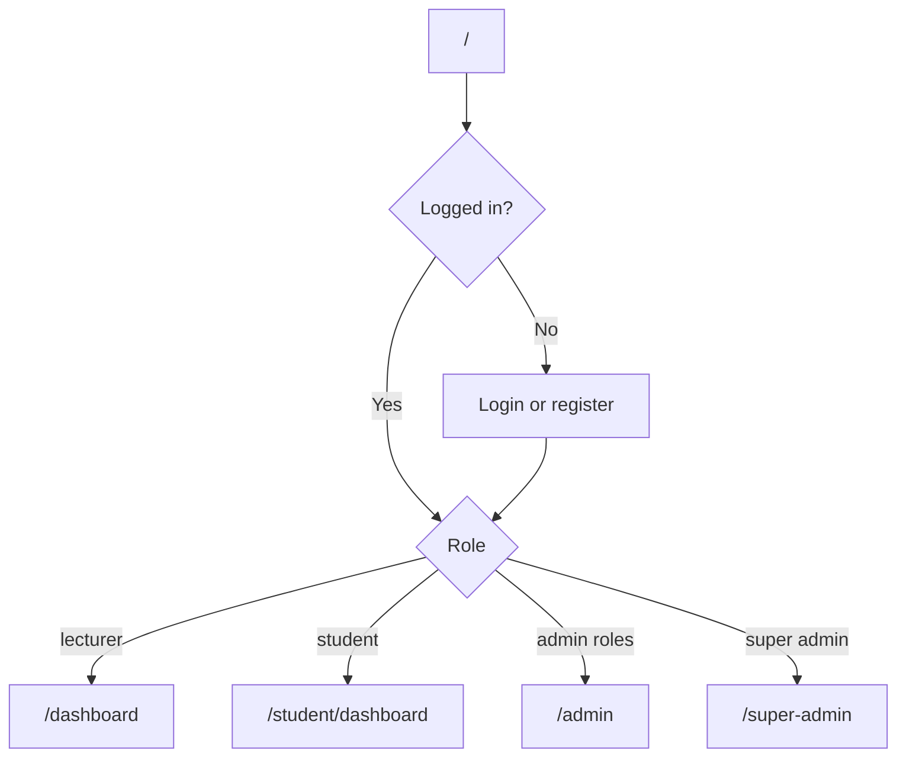
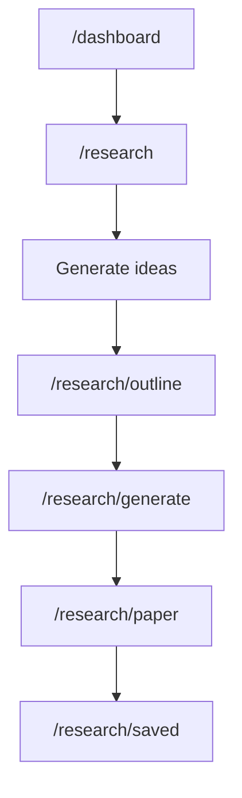
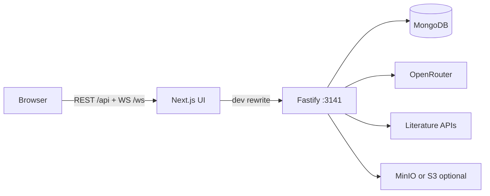
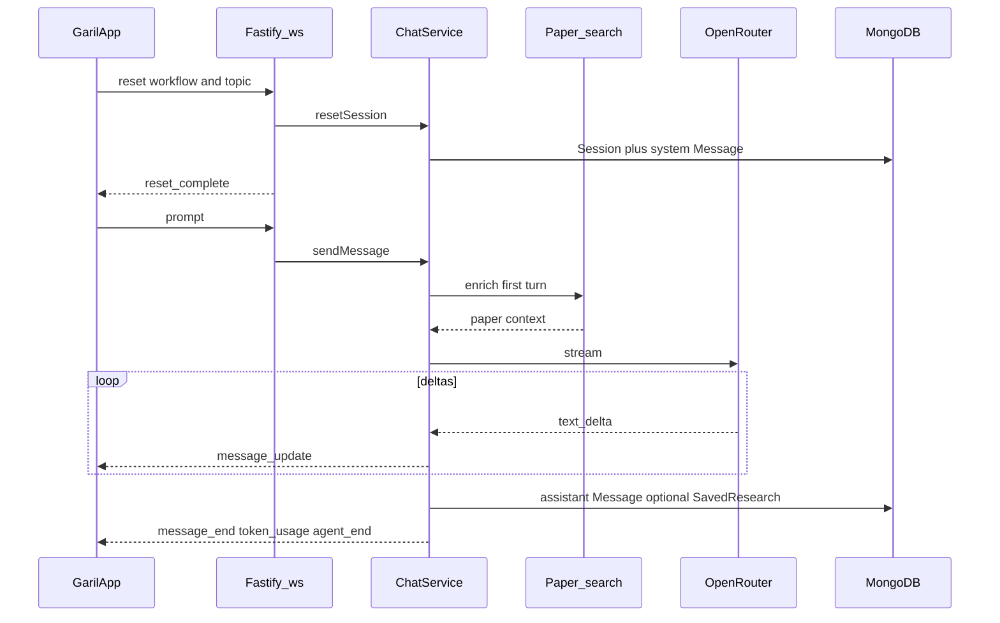

# GARIL AI — Full Project Manual

**GARIL AI** (*Governed AI for Research, Instruction and Learning*) is a university-grade platform for academic research and paper writing. It combines agentic AI workflows, literature retrieval, citation-verified drafting, supervision tools, and institutional AI governance.

Built for universities, colleges, polytechnics, lecturers, and students (Nigeria and beyond). Product entity: TrustLed AI Ltd.

**Related docs:** [README.md](../README.md) (quick start) · [PROJECT_WORKFLOW.md](../PROJECT_WORKFLOW.md) (architecture deep-dive) · [deploy/README.md](../deploy/README.md) (deployment hub)

> **Legacy naming:** Packages, env vars, and tokens still use the older “feynman” brand (`feynman-web`, `feynman-backend`, `feynman_auth_token`, `FEYNMAN_*`, `NEXT_PUBLIC_FEYNMAN_BACKEND`). They refer to this same product.

---

## Table of contents

**Part A — Product (end users)**

1. [Roles and access](#1-roles-and-access)
2. [Getting started](#2-getting-started)
3. [Lecturer workspace](#3-lecturer-workspace)
4. [Student workspace](#4-student-workspace)
5. [Research scopes](#5-research-scopes)
6. [Admin and governance console](#6-admin-and-governance-console)
7. [Super-admin](#7-super-admin)
8. [Token quotas](#8-token-quotas)

**Part B — Technical / ops**

9. [Architecture](#9-architecture)
10. [How the AI runtime works](#10-how-the-ai-runtime-works)
11. [Local development](#11-local-development)
12. [Environment reference](#12-environment-reference)
13. [Auth and tenancy](#13-auth-and-tenancy)
14. [API and WebSocket reference](#14-api-and-websocket-reference)
15. [Data model overview](#15-data-model-overview)
16. [Literature and citation integrity](#16-literature-and-citation-integrity)
17. [Deployment](#17-deployment)
18. [Database ops](#18-database-ops)
19. [Testing and CI](#19-testing-and-ci)
20. [File map and glossary](#20-file-map-and-glossary)

---

# Part A — Product

## 1. Roles and access

| Role | Who | Typical access |
|------|-----|----------------|
| **Student** | Enrolled learners | Research Assistant (token-metered), notebook, supervised projects, assignments, feedback, notifications |
| **Lecturer / researcher** | Faculty | Same research tools + supervise projects, reviews, assignment briefs, students, analytics |
| **University admin roles** | Institutional governance staff | Governance console for **their university** (analytics, tokens, audit, alerts, incidents, users, reports, contributions, provenance, policies, privacy, retention) — filtered by feature permissions |
| **Super admin** (`role === "admin"`) | Platform operators | Onboard universities, all users/admins, platform tokens, activities, research content, backups |

**Console role names** (feature-permission matrix in `User` model): `governance_admin`, `faculty_admin`, `department_admin`, `compliance_officer`, `data_protection_officer`, `research_integrity_officer`, `auditor`, plus `viewer`.

### Registration rules

- Users register against an **onboarded** (active) university. Platform admin accounts are exempt from that gate.
- Lecturers cannot register with free-email domains (institutional email required).
- Students use `/student/register`; lecturers/researchers use `/register`.

---

## 2. Getting started

### Login paths

| Audience | Login | Register |
|----------|-------|----------|
| Lecturer / researcher | `/login` | `/register` |
| Student | `/student/login` | `/student/register` |
| University admin | `/admin/login` | (provisioned by admin/super-admin) |
| Super admin | `/super-admin/login` | (bootstrap / env default admin) |

### Where you land after login

| Role | Home |
|------|------|
| Student | `/student/dashboard` |
| Lecturer / researcher / others | `/dashboard` |
| University admin | `/admin` |
| Super admin | `/super-admin` |

Public marketing landing: `/`. Health check page: `/healthz`.



---

## 3. Lecturer workspace

Sidebar and dashboard tools are defined in `lib/aula-nav.ts`.

### Canonical research flow



| Step | Route | What you do |
|------|-------|-------------|
| 1. Ideas | `/research` or `/research/[scope]` | Pick discipline, topic, and research type (scope); generate idea options |
| 2. Outline | `/research/outline` | Build a literature-backed Markdown outline |
| 3. Configure | `/research/generate` | Citation style and paper options |
| 4. Draft | `/research/paper` | Stream a full paper via the Research Assistant (`chat-paper` workflow) |
| 5. Library | `/research/saved` | Open persisted papers |
| Assignment path | `/research/assignment` | Assignment-oriented research entry |

### Lecturer route map

| Feature | Routes |
|---------|--------|
| Dashboard | `/dashboard`, `/dashboard/research` |
| Research Assistant | `/research`, `/research/[scope]`, `/research/outline`, `/research/generate`, `/research/paper`, `/research/assignment`, `/research/saved` |
| Research Notebook | `/research/notebook`, `/research/notebook/[projectId]` |
| Supervision | `/supervision`, `/supervision/projects`, `/supervision/projects/[projectId]`, `.../pages/[pageId]` |
| Reviews | `/reviews`, `/reviews/[id]` |
| Assignments | `/assignments`, `/assignments/new`, `/assignments/[id]`, `/assignments/[id]/edit` |
| Students | `/students`, `/students/[id]` |
| Analytics / notifications | `/analytics`, `/notifications` |
| Alternate project editor | `/projects`, `/projects/[projectId]`, `.../pages/[pageId]` |
| Legacy chat | `/chat` |

### Supervision Assistant

Use **Projects** (`/supervision/projects`) to supervise theses, dissertations, and student research folders: pages/chapters, TipTap editing, topic approval, AI chapter review, scoring, document import/export, and notifications.

**Assignments** publish briefs and collect submissions. **Reviews** is the inbox for submitted chapters and drafts. **Students** lists supervisees.

---

## 4. Student workspace

Nav: `lib/student-nav.ts`. Research mirrors the lecturer funnel under `/student/research/*`.

| Feature | Routes |
|---------|--------|
| Dashboard | `/student/dashboard` |
| Research Assistant | `/student/research`, `/student/research/[scope]`, `/outline`, `/generate`, `/paper`, `/assignment`, `/saved` |
| Notebook | `/student/research/notebook`, `/student/research/notebook/[projectId]` |
| Student Assistant hub | `/student/assistant` |
| Projects | `/student/projects`, `/student/projects/new`, `/student/projects/[id]`, `.../pages/[pageId]` |
| Assignments | `/student/assignments`, `/student/assignments/[id]` |
| Feedback | `/student/feedback`, `/student/feedback/[projectId]/[itemKey]` |
| Notifications | `/student/notifications` |

Student AI usage is **token-metered** (see [Token quotas](#8-token-quotas)). When the allowance is exhausted, generation and chat runs that deduct tokens will fail until an admin raises the quota.

---

## 5. Research scopes

Research Type (scope) controls document structure, per-section in-text citation floors, word targets, and minimum distinct bank references. Profiles live in `lib/research-scope-profiles.ts` (mirrored on the backend).

| Scope | Label | Min distinct cites | Word target (approx.) |
|-------|-------|--------------------|------------------------|
| `assignment` | Assignment | 20 | 1,900–2,100 |
| `conference` | Conference paper | 20 | 3,000–4,000 |
| `journal` | Journal / Research Paper | 25 | 4,000–6,000 |
| `project_report` | Project report | 20 | 3,000–5,000 |
| `proposal` | Research proposal | 20 | 2,000–4,000 |
| `faculty` | Faculty / grant | 30 | 4,000–6,000 |
| `undergraduate` | Undergraduate project | 25 | 6,000–8,000 |
| `thesis` | Thesis | 40 | 8,000–10,000 |
| `dissertation` | Dissertation | 50 | 10,000–12,000 |

Example: **Assignment** uses Introduction → Literature Review → Critical Analysis → Conclusion (no Methods/Results). **Journal** uses IMRaD-style headings. Longer forms (thesis/dissertation) use chapter-style structures and higher citation floors.

The LLM is instructed to cite only papers from the retrieved **citation bank** for that run.

---

## 6. Admin and governance console

Login: `/admin/login`. Nav groups: `lib/admin-nav.ts` → `ADMIN_NAV_GROUPS`.

| Area | Routes | Purpose |
|------|--------|---------|
| Overview | `/admin` | Governance hub: usage, alerts, adoption, health |
| Usage | `/admin/analytics`, `/admin/tokens` | Adoption and token consumption |
| Accountability | `/admin/audit`, `/admin/alerts`, `/admin/incidents`, `/admin/users` | Audit log, alerts, incidents, user lifecycle |
| Reporting | `/admin/reports` | Management / Senate / auditor reports |
| Academic products | `/admin/modules`, `/admin/supervision`, `/admin/assessment` | Product module toggles; supervision and Student Assessment oversight (metadata only) |
| Research integrity | `/admin/contributions`, `/admin/provenance` | AI contribution statements and provenance (titles may be privacy-protected) |
| Controls | `/admin/policies`, `/admin/privacy`, `/admin/retention` | Policies, privacy rules, retention/deletion |

Access is scoped to the admin’s **university** and **feature permissions**. Governance oversight does not expose raw research materials unless policy allows it.

### Stub / removed UI

These paths **redirect to `/admin`**. Backend models/services may still exist:

- `/admin/risks`
- `/admin/compliance`
- `/admin/inventory`
- `/admin/approvals`

---

## 7. Super-admin

Login: `/super-admin/login`. Home: `/super-admin`.

| Route | Purpose |
|-------|---------|
| `/super-admin` | Platform overview |
| `/super-admin/universities` | Onboard / manage universities |
| `/super-admin/universities/detail` | University detail |
| `/super-admin/users` | Platform-wide users |
| `/super-admin/admins` | University / platform admins |
| `/super-admin/tokens` | Token defaults and usage |
| `/super-admin/activities` | Platform activity |
| `/super-admin/research` | Research content oversight |
| `/super-admin/supervision` | Platform supervision projects (metadata) |
| `/super-admin/assessment` | Platform assignment briefs and submissions (metadata) |

University product modules (Research Assistant, Notebook, Student Assessment, Supervision, Advanced Research) are configured on `/admin/modules` or the university detail **Modules** tab in super-admin.

Super admins bypass per-feature checks and can offboard universities, reset passwords, and run backups (via admin APIs).

---

## 8. Token quotas

Defaults (`backend/src/constants/student-tokens.ts`):

| Role | Default allowance |
|------|-------------------|
| Student | **400,000** tokens |
| Lecturer / researcher | **1,000,000** tokens |

**Resolution order:** per-user override → university defaults → platform default.

Admins manage allowances under `/admin/tokens` (university) or `/super-admin/tokens` (platform). Remaining quota can appear in the UI and via WebSocket `student_token_quota` events during chat.

---

# Part B — Technical / ops

## 9. Architecture



| Layer | Stack | Default local URL |
|-------|--------|-------------------|
| Frontend | Next.js 16, React 19, TypeScript, Tailwind 4 | http://localhost:3000 |
| Backend | Fastify 5, TypeScript, Node `>=20.19 <26` | http://127.0.0.1:3141 |
| Database | MongoDB via Mongoose 8 | `mongodb://127.0.0.1:27017/feynman` |
| AI | OpenRouter | — |
| Real-time | WebSocket `/ws` | Proxied via Next in dev |
| Editors / export | TipTap; jspdf, docx, pptxgenjs, mammoth, xlsx | — |

**Frontend vs backend:** Almost all business logic lives in Fastify. The Next app is the UI. In development, `next.config.ts` rewrites `/api/*` and `/ws` to `FEYNMAN_BACKEND_URL` (default `http://127.0.0.1:3141`). In production, set `NEXT_PUBLIC_FEYNMAN_BACKEND`, use a reverse proxy for same-origin, or serve static/standalone from the chosen deploy mode.

**No separate workers:** Research jobs run in-process (`research-jobs.service.ts`). No Redis/queue package.

**Supabase:** `@supabase/supabase-js` appears in `package.json` and optional `NEXT_PUBLIC_SUPABASE_*` in frontend `.env.example`, but **is not used** by application code. Primary database is MongoDB.

---

## 10. How the AI runtime works

Orchestration: `backend/src/services/chat.service.ts` over WebSocket `/ws`.



1. **Session** — `reset` loads a workflow prompt from `backend/prompts/*.md`, creates Mongo `Session` + system `Message`.
2. **Literature** (first user turn, research workflows) — builds a citation bank and injects abstracts/metadata into context.
3. **LLM stream** — OpenRouter; token deltas over WebSocket.
4. **Post-process** — format references (e.g. `chat-paper`), auto-save `SavedResearch` when long enough, deduct tokens.

> **Runtime truth:** Prompt Markdown may describe tools (`web_search`) or subagents. The Fastify runtime does **not** run a general tool-calling agent loop. It uses **literature enrichment + LLM streaming**. Prompts still shape structure and quality.

### Workflow prompts

| Command | Description |
|---------|-------------|
| `/chat-paper` | Full academic paper with inline citations (primary UI path) |
| `/deepresearch` | Multi-step investigation protocol (plan → gather → draft → cite → review → deliver) |
| `/lit` | Literature review grounded in retrieved papers |
| `/draft` | Structured section drafting |
| `/compare` | Side-by-side study comparison |
| `/summarize` | Concise summary |
| `/audit` | Citation / integrity audit |
| `/autoresearch` | Autonomous experiment-style loop |
| `/watch` | Monitor a topic |
| `/log` | Session journaling (skips literature inject) |
| `/replicate` | Replication planning |
| `/recipe` | Methodology builder |
| `/jobs` | Background task inspection (skips literature inject) |

### Other AI paths

| Path | Service |
|------|---------|
| Idea generation | `research-ideas.service.ts` |
| Outlines | `outline.service.ts` |
| Async paper jobs | `research-jobs.service.ts` |
| Citation align / format | `citation-align.service.ts`, research paper format services |
| Optional HF embed / NLI | `huggingface.service.ts` |
| Portal chapter AI review / chat | `portal-ai.service.ts`, `lib/portal-review/*` |

Models: `FEYNMAN_MODEL` (main), `FEYNMAN_FAST_MODEL` (ideas/light), `FEYNMAN_OUTLINE_MODEL` (outlines).

---

## 11. Local development

### Prerequisites

- Node.js `>=20.19.0 <26` (`.nvmrc` pins `25`; helper `backend/scripts/with-node.sh`)
- MongoDB local or remote

### Install

```bash
npm install
cd backend && npm install
```

(The repo also has `pnpm-lock.yaml`; documented path uses **npm**.)

### Environment

```bash
cp deploy/backend/.env.example backend/.env
```

Set at least `OPENROUTER_API_KEY` and a strong `AUTH_SECRET` for anything beyond casual local use. See [Environment reference](#12-environment-reference).

### Run

```bash
# Terminal 1 — UI
npm run dev

# Terminal 2 — API
npm run dev:backend
```

| Service | URL |
|---------|-----|
| Frontend | http://localhost:3000 |
| Backend | http://127.0.0.1:3141 |
| Health | `GET http://127.0.0.1:3141/api/health` |

### Useful scripts

| Script | Purpose |
|--------|---------|
| `npm run build` / `build:all` | Next + backend `tsc` |
| `npm run start` | `node backend/dist/index.js` |
| `npm run lint` | Next lint |
| `npm run test:pdf` | PDF smoke runner |
| `npm run deploy:build*` | Production packaging |

Helpers: `dev-backend.sh`, `start-backend.sh`.

### Smoke checklist

1. `GET /api/health` returns OK
2. Register/login as lecturer or student against an onboarded university (or use default admin)
3. Generate research ideas → outline
4. Open `/research/paper` and confirm WebSocket streaming
5. Admin: open `/admin` after admin login

---

## 12. Environment reference

**Canonical accessors:** `backend/src/config/env.ts`  
**Templates:** `deploy/backend/.env.example`, `deploy/frontend/.env.example`, `deploy/minio/.env.example`  
Never commit real secrets (`.env` / `backend/.env` are gitignored).

### Core (backend)

| Variable | Required | Purpose |
|----------|----------|---------|
| `OPENROUTER_API_KEY` | Yes | LLM calls |
| `AUTH_SECRET` | Yes in production | HMAC JWT signing |
| `MONGODB_URI` | Yes in prod/Docker | Mongo connection (local default `mongodb://127.0.0.1:27017/feynman`) |
| `PORT` | No | API port (default `3141`) |
| `CORS_ORIGIN` | No | Comma-separated allowed origins |

### Models / workspace

| Variable | Purpose |
|----------|---------|
| `FEYNMAN_MODEL` | Main chat model |
| `FEYNMAN_FAST_MODEL` | Ideas / light tasks |
| `FEYNMAN_OUTLINE_MODEL` | Outlines |
| `FEYNMAN_WORKSPACE` / `FEYNMAN_REPO_ROOT` | Path overrides |
| `OPENAI_MODEL` | Portal AI naming fallback |

### Literature / ML

| Variable | Purpose |
|----------|---------|
| `ALPHAXIV_*` | AlphaXiv (enabled, key, base, MCP URL) |
| `ARXIV_API` | arXiv export URL |
| `TAVILY_ENABLED`, `TAVILY_API_KEY` | Web search fallback |
| `OPENALEX_*` | OpenAlex |
| `PUBMED_*` / `NCBI_API_KEY` | PubMed / NCBI |
| `DOAJ_*` | DOAJ |
| `EUROPE_PMC_*` | Europe PMC |
| `HF_TOKEN` / `HUGGINGFACE_*` | Optional embeddings / NLI |
| `PAPER_LIBRARY_ENABLED`, `PAPER_LIBRARY_MIN_HITS` | Mongo paper-library RAG |

### Admin bootstrap

| Variable | Purpose |
|----------|---------|
| `DEFAULT_ADMIN_EMAIL` / `PASSWORD` / `NAME` | Seeded platform admin |
| `DEFAULT_ADMIN_ENABLED` | Set `false` to disable auto-bootstrap |
| `SEED_STUDENT_PASSWORD` | Demo seed scripts only |

### S3 / MinIO (backend)

`S3_ENDPOINT`, `S3_REGION`, `S3_BUCKET`, `S3_ACCESS_KEY`, `S3_SECRET_KEY`, `S3_FORCE_PATH_STYLE`, `S3_PUBLIC_URL`, `S3_MAX_UPLOAD_BYTES`, `S3_MAX_INLINE_BYTES`

See [deploy/minio/README.md](../deploy/minio/README.md).

### Frontend / Next

| Variable | Purpose |
|----------|---------|
| `NEXT_PUBLIC_FEYNMAN_BACKEND` | Browser API origin (empty = same-origin) |
| `FEYNMAN_BACKEND_URL` | Dev rewrite target (default `http://127.0.0.1:3141`) |
| `GARIL_STATIC_EXPORT` | `0` → Next **standalone**; unset in prod often means static `export` to `out/` |
| `NEXT_PUBLIC_SUPABASE_*` | Documented optional; **unused in current app code** |

---

## 13. Auth and tenancy

1. Register/login → password hash (`backend/src/lib/password.ts`) → HMAC JWT (~7-day TTL) via `backend/src/lib/auth-token.ts` and `AUTH_SECRET`.
2. Frontend stores token as `feynman_auth_token` in `localStorage` (`lib/auth.ts`); `hooks/useAuth.tsx` refreshes via `GET /api/auth/me`.
3. HTTP: `Authorization: Bearer <token>`. WebSocket: token on the connection query string.
4. **University gate:** only active onboarded universities may register/login (except platform `admin`).
5. **Portal authz:** `requirePortalActor` / student vs supervisor (`backend/src/lib/portal-auth.ts`); tenant key = `universityId`.
6. **Admin authz:** `requireAdmin` / `requireSuperAdmin` / `requireAdminScope` / `requireFeatureAccess` (`backend/src/lib/require-admin.ts`).
7. **No Next.js middleware** for auth — protection is client redirects + API enforcement.

---

## 14. API and WebSocket reference

All HTTP APIs are Fastify: `backend/src/server.ts` + `backend/src/routes/portal.ts`.  
Frontend portal client maps `/api/v1/*` → `/api/portal/*` (`lib/portal-api.ts`).

### Auth and system

| Method | Path | Purpose |
|--------|------|---------|
| GET | `/api/health` | Liveness (may include S3 status) |
| GET | `/api/auth/universities` | Onboarded universities for signup |
| GET | `/api/auth/universities/catalogue` | Country catalogue (Hipolabs) |
| POST | `/api/auth/register` | Lecturer register |
| POST | `/api/auth/register-student` | Student register |
| POST | `/api/auth/login` | Issue JWT |
| GET | `/api/auth/me` | Current user + quota |
| GET | `/api/workflows` | Prompt workflow list |
| GET | `/api/status` | Chat service status |
| GET | `/ws` | Agent WebSocket |

### Research

| Family | Purpose |
|--------|---------|
| `GET /api/papers/search` | Literature search |
| `POST /api/research/outline` | Literature-grounded outline |
| `POST /api/research/ideas/generate` | Idea generation |
| `/api/research/jobs*` | Async paper jobs (start / active / get / cancel) |
| `/api/research/saved*` | Saved papers CRUD |
| `/api/research/ideas/saved*`, `/sessions*`, `/outlines/saved*` | Ideas, sessions, outlines |
| `/api/research/projects*`, `/project`, `/workspace`, `/activity` | Notebook projects |
| `/api/research/documents*`, `/references*`, `/datasets*`, `/questionnaires*` | Notebook assets (+ upload sessions) |
| `POST /api/research/source-context`, `/visualizations`, `/outputs/sync` | Context, plots, sync |
| `/api/session/reset`, `/api/chat/abort`, `/api/sessions/:id/messages` | Chat control |

### Portal (`/api/portal/*`)

Projects (CRUD, pages, review, AI summary/chat, topic submit/approve, attach brief, score, import/export, images), chapters (approve/reject/save-review/ai-reviewer/versions), assignment briefs + submissions, feedback, notifications, deadlines, analytics overview, students/supervisors lists, supervisor reviews inbox.

### Admin (`/api/admin/*`)

Universities, users, admins, tokens, sessions, research papers/uploads, backup, governance overview/analytics, policies (+ evaluate), audit (+ flag), reports, incidents, alerts, contributions, provenance, privacy, retention (+ deletion requests).

### Dashboard / legacy

`GET /api/dashboard/stats`, `/api/dashboard/sessions`, `/api/users` (+ `:id`).

### WebSocket protocol

**Client → server**

| Message | Purpose |
|---------|---------|
| `{ type: "reset", workflow?, topic?, message? }` | New session / workflow |
| `{ type: "prompt", message }` | User turn |
| `{ type: "abort" }` | Cancel run |

**Server → client**

| Message | Purpose |
|---------|---------|
| `connected` | Status + workflow list |
| `agent_event` | `agent_start`, `tool_execution_*`, `message_update`, `message_end`, `token_usage`, `agent_end` |
| `reset_complete` / `prompt_complete` / `aborted` / `error` | Lifecycle |
| `student_token_quota` | Remaining tokens |

**Paper client sequence** (`hooks/useGarilSocket.ts`): `reset` with `workflow: "chat-paper"` → on `reset_complete`, send `prompt` with the full paper prompt.

---

## 15. Data model overview

MongoDB via Mongoose (`backend/src/db/connect.ts`). Models under `backend/src/db/models/`.

| Group | Models |
|-------|--------|
| Identity / tenancy | `User`, `University` |
| Chat | `Session`, `Message` |
| Research outputs | `SavedResearch`, `SavedResearchIdea`, `SavedResearchOutline`, `ResearchIdeaSession`, `ResearchJob`, `OutputArtifact` |
| Notebook | `ResearchProject`, `ResearchDocument`, `ResearchDataset`, `ResearchReference`, `ResearchQuestionnaire` |
| Literature cache | `PaperLibrary` |
| Supervision portal | `PortalProject`, `PortalChapter`, `PortalChapterVersion`, `PortalAiReview`, `PortalNotification`, `AssignmentBrief` |
| Governance | `AuditLog`, `GovernanceAlert`, `GovernanceIncident`, `GovernancePolicy`, `GovernanceReport`, `GovernanceRisk` |
| Integrity / privacy | `AiContributionStatement`, `ResearchProvenanceRecord`, `ResearchPrivacySetting` |
| Compliance (backend; some UI stubbed) | `RetentionPolicy` (+ `DeletionRequest`), `ComplianceControl`, `AiSystemInventory`, `ApprovalRequest` |

**Tenancy:** primarily `universityId` on users and portal/governance documents.

---

## 16. Literature and citation integrity

### Retrieval order (library-first RAG)

Priority used when building banks (see `PROJECT_WORKFLOW.md` and literature services):

1. **Mongo paper library** (if enabled and enough hits; default min hits = 4)
2. **AlphaXiv** (and MCP when keyed)
3. **arXiv**
4. **OpenAlex**, **PubMed**, **DOAJ**, **Europe PMC** (as configured / interleaved)
5. **Tavily** — web fallback when scholarly sources under-fill

New hits are upserted into the paper library for reuse (deduped by arXiv ID / title where applicable).

### Citation rules

- The model should cite only papers present in the **retrieved bank** for that run.
- Scope profiles set minimum distinct bank references and per-section cite floors.
- Post-processing aligns and formats references (`citation-align.service.ts`, paper format services).
- Outline generation fetches up to ~8 papers, injects abstracts, then appends a “Sources for further reading” section.

---

## 17. Deployment

Hub: [deploy/README.md](../deploy/README.md). **Not Vercel** — Coolify / Docker / VPS / Nixpacks. **No in-repo CI.**

### Modes

| Mode | Entry | Notes |
|------|-------|--------|
| **Coolify split (recommended)** | `deploy/backend/Dockerfile` + `deploy/frontend/Dockerfile` | API `:3141` `/api/health`; UI `:80` `/healthz` |
| **Docker Compose** | `docker-compose.yml` | mongo + backend + frontend |
| **All-in-one** | Root `Dockerfile` or `deploy/all-in-one/` | Single Node process |
| **MinIO** | `deploy/minio/` | Optional S3-compatible storage |

Detailed Coolify/VPS/PM2 steps: [deploy/backend/README.md](../deploy/backend/README.md), [deploy/frontend/README.md](../deploy/frontend/README.md), [deploy/all-in-one/README.md](../deploy/all-in-one/README.md).

### Frontend: standalone vs static export

| Mode | How | Use when |
|------|-----|----------|
| **Standalone** (Coolify Dockerfile) | `GARIL_STATIC_EXPORT=0` → Next standalone (`node server.js` on port 80) | Current `deploy/frontend/Dockerfile` path; supports dynamic App Router routes |
| **Static export** | Leave `GARIL_STATIC_EXPORT` unset for production `output: "export"` → `out/` + nginx | Older VPS/nginx `out/` deploys (`deploy/frontend/build.sh` + nginx confs) |

Build arg / env: `NEXT_PUBLIC_FEYNMAN_BACKEND` = public API URL (or empty for same-origin proxy).

### Compose quick start

```bash
cp deploy/backend/.env.example backend/.env
export NEXT_PUBLIC_FEYNMAN_BACKEND=http://localhost:3141
docker compose up -d --build
```

---

## 18. Database ops

- **No migration runner** (no Prisma/Drizzle). Schema = Mongoose models. Change models carefully in production.
- **Connect** (`backend/src/db/connect.ts`): retries in production; index repair (e.g. legacy unique `userId` on research projects; paper-library `syncIndexes`).
- **Default admin:** created on boot via `bootstrap-admin.service.ts` unless `DEFAULT_ADMIN_ENABLED=false`. One-shot script: `backend/scripts/ensure-default-admin.ts`.
- **Demo seeds** (not general fixtures): `seed-okes-survey.ts`, `seed-okes-supervision.ts` (`SEED_STUDENT_PASSWORD`).
- **Governance cleanup** on boot may remove old mock rows (`admin-governance-cleanup.service.ts`).

---

## 19. Testing and CI

| What exists | Command / path |
|-------------|----------------|
| Lint | `npm run lint` |
| Backend typecheck | `cd backend && npm run typecheck` |
| PDF smoke | `npm run test:pdf` → `scripts/test-research-pdf-runner.ts` |

**Missing:** Jest/Vitest/Playwright/Cypress; no `*.test.*` / `*.spec.*`; **no `.github/workflows` CI**.

Release path today: Coolify git deploy, Docker build, or VPS `setup-vps.sh` / PM2 / systemd. Suggested future CI: lint + `tsc` + health probe.

Recommended manual smoke: [Local development](#11-local-development) checklist plus portal project create and admin token page.

---

## 20. File map and glossary

### Key paths

| Concern | Path |
|---------|------|
| Product docs | `README.md`, `PROJECT_WORKFLOW.md`, `docs/PROJECT_MANUAL.md` |
| Deploy hub | `deploy/README.md` |
| Next config | `next.config.ts` |
| Env accessors | `backend/src/config/env.ts` |
| Server / WS | `backend/src/index.ts`, `backend/src/server.ts` |
| Portal routes | `backend/src/routes/portal.ts` |
| Chat / LLM | `backend/src/services/chat.service.ts`, `llm.service.ts` |
| Workflows | `backend/src/services/workflows.ts`, `backend/prompts/` |
| Auth | `backend/src/services/auth.service.ts`, `backend/src/lib/auth-token.ts`, `hooks/useAuth.tsx`, `lib/auth.ts` |
| Models | `backend/src/db/models/` |
| Research UI | `components/ResearchAssistant.tsx`, `components/GarilApp.tsx`, `hooks/useGarilSocket.ts` |
| API base URL | `lib/api.ts` |
| Role routing | `lib/dashboard-routes.ts` |
| Scope profiles | `lib/research-scope-profiles.ts` |
| Admin / student nav | `lib/admin-nav.ts`, `lib/aula-nav.ts`, `lib/student-nav.ts` |

### Glossary

| Term | Meaning |
|------|---------|
| **GARIL** | Governed AI for Research, Instruction and Learning |
| **Feynman** | Legacy internal/package name for the same product |
| **Workflow** | Markdown system prompt in `backend/prompts/` conditioning the chat session |
| **Citation bank** | Set of papers retrieved and injected before generation |
| **Scope / Research Type** | Deliverable profile (assignment, thesis, …) controlling structure and cite floors |
| **Portal** | Supervision / project / chapter / assignment subsystem (`/api/portal/*`) |
| **Paper library** | Mongo cache of scholarly metadata for library-first RAG |
| **Token quota** | Usage allowance for student/lecturer AI calls |

### Empty placeholders

`app/settings/` and `app/review-desk/` exist as directories without pages yet.

---

*End of manual. For shorter setup instructions see [README.md](../README.md). For sequence-level research pipeline detail see [PROJECT_WORKFLOW.md](../PROJECT_WORKFLOW.md).*
